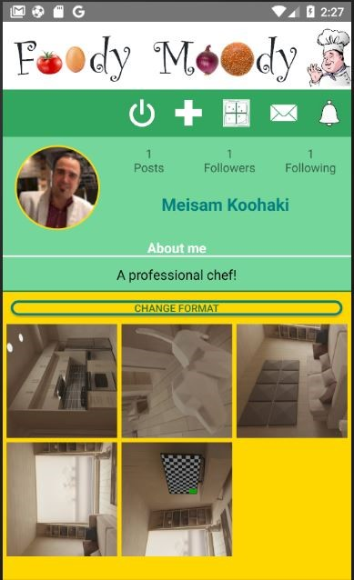
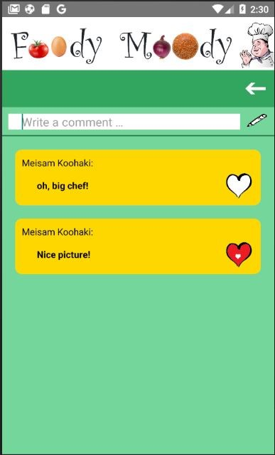

# FOODY MOODY

Author: Meisam Koohaki/Edwin Christie/Michael Valadao-Martins
Winter, 2021
Foody Moody is an Android application which is created in Android Studio with using Kotlin
This applicatoin is a social application like Instagram but for food lovers and who love cooking, then users can share their images of food and cooking.

 

